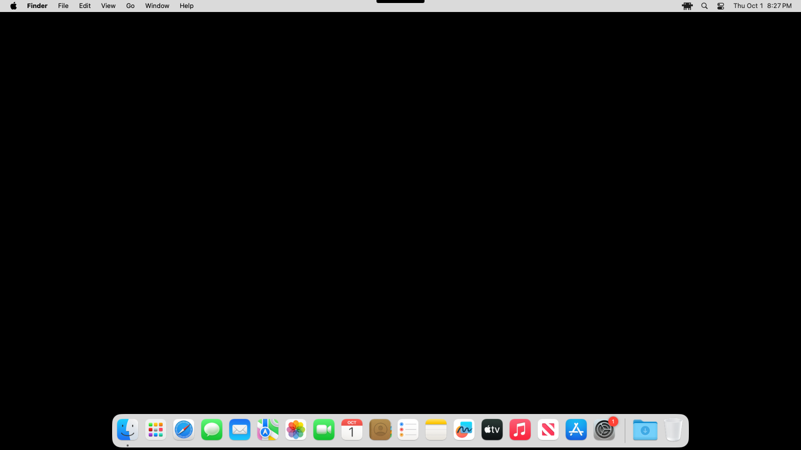
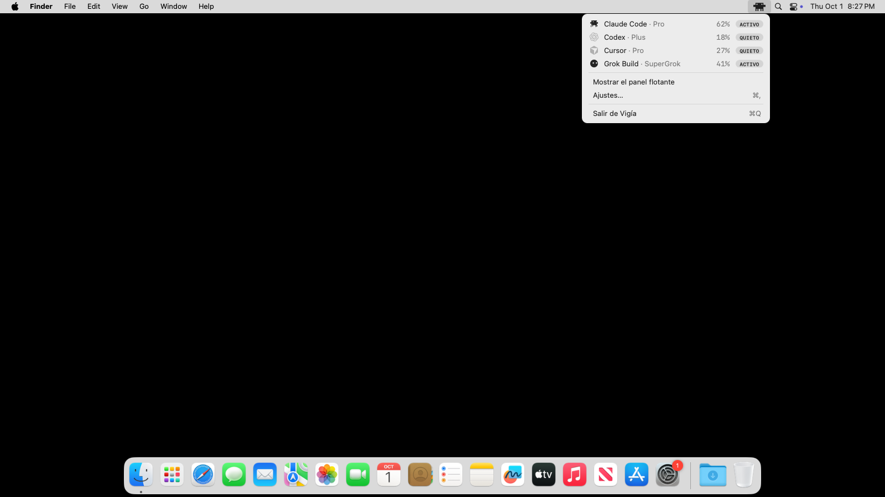
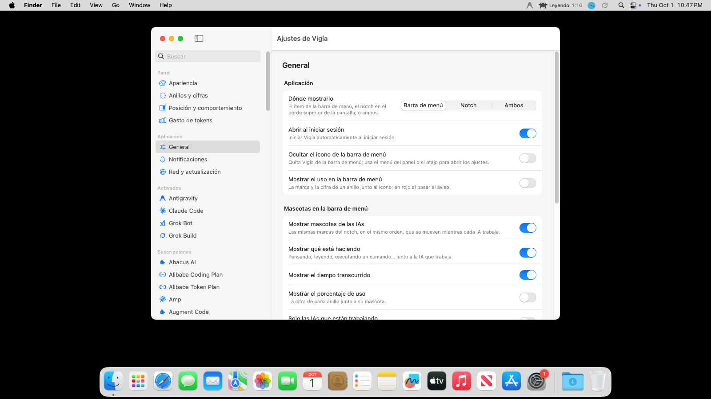

# Vigía

Vigía es una app de barra de menú para macOS. Muestra, para cada agente de IA en este Mac, si está trabajando ahora y cuánto lleva usado de sus límites. No llama a ningún modelo: lee lo que esos programas ya guardaron en el equipo.

Cubre Claude Code, Codex, Cursor, Gemini CLI y Grok Build (`~/.grok`), y el resto de proveedores que ya sabían leer los proyectos de los que sale esta app (más de setenta).

## Qué hace

- **Barra de menú.** Una mascota por cada IA de tu panel, en el mismo orden que el notch: Clawd (el cangrejo en píxeles) para Claude Code, la bolita de Grok Bot, y el logo de las demás, o su mascota animada si la activas. Se mueven solo mientras esa IA trabaja y, junto a ella, aparece qué está haciendo y cuánto lleva: *Pensando… 0:13*, *Leyendo 1:04*, *Ejecutando comando 0:07*. Las que no hacen nada se quedan quietas.
- **Clic en la barra de menú.** Abre la tarjeta de detalle de cada IA, la misma que el notch muestra al dejar el puntero sobre un anillo: sus límites, cuándo se reinician y si van a alcanzar.
- **Notch.** El panel del borde de la pantalla, con los anillos de uso. Se abre al pasar el puntero o al hacer clic.
- **Ajustes de la barra de menú.** Activar o quitar las mascotas, el texto de lo que hace cada IA, el tiempo transcurrido y el porcentaje de uso; mostrar solo las IAs que están trabajando; y elegir cuáles aparecen.
- **Español o inglés.** La interfaz está completa en los dos idiomas y nunca se mezclan. «Sistema» usa español si tu Mac está en español y, en cualquier otro caso, inglés.

La apariencia clara y oscura sigue al sistema. Cada agente tiene un interruptor en Ajustes para usar el logo oficial o la mascota animada.

## Animaciones

Cada mascota muestra qué está haciendo la IA. Claude Code tiene a Clawd, y cualquier otra IA puede usar la bolita animada (mismo motor, cada una con su color y su personalidad) si activas su interruptor; las demás animan su logo. Donde Vigía puede ver las sesiones del agente (Claude Code, Codex, Cursor, Gemini CLI, Grok Build…), las poses salen de la actividad real, y lo que dice el texto de la barra de menú es lo que se ve.

| Situación | Clawd | Bolita (Grok Bot) | Logo |
| --- | --- | --- | --- |
| Ejecuta un comando, edita, escribe, planea o piensa | Teclea en una laptop | Escena de «escribir» o «trabajar» con una laptop delante | Un brillo cruza el logo |
| Busca, lee, navega o delega | Camina de prisa | Escena de «buscar», con líneas de velocidad | Tres puntos orbitan el logo |
| Acaba de terminar un turno (5 min) | Toma café, con vapor | Canturrea con una taza humeante | Vapor sube del logo |
| Quieta y despierta | Parpadea | Su rutina de siempre | Respira |
| Sin actividad (20 min) | Duerme con «Z» | Se adormila y duerme, con «z» | Atenuado, con «z» |
| Límite al 75 % o más | Cansado: párpados caídos y una gota de sudor | Cansada, con una gota de sudor | Se ladea y suda |
| Límite al 100 % | Ojos en X y estrellas mareadas | Se apaga, con estrellas mareadas | Tiembla entre estrellas |

Trabajar manda sobre todo, y el descanso de después del turno también; el cansancio y el agotamiento se ven cuando no está trabajando ni de descanso.

Las IAs que no se pueden observar (Grok Bot, por ejemplo) no «trabajan»: muestran primero el cansancio y el agotamiento según su límite y, si no, van cambiando de escena a lo largo del día: duermen de noche (23:00 a 06:00), toman café por la mañana y después, cada cuarto de hora, parpadean, descansan, teclean en la laptop o salen a correr. Los logos solo descansan y toman café. Con «Reducir movimiento» activado en macOS los logos se quedan quietos. En Ajustes, Clawd puede conservar el naranja de Claude en la barra de menú.

## Capturas

El notch plegado, el notch abierto, la barra de menú con su menú, y la ventana de ajustes:

<picture>
  <source media="(prefers-color-scheme: dark)" srcset="docs/notch-collapsed-dark.png">
  
</picture>

<picture>
  <source media="(prefers-color-scheme: dark)" srcset="docs/notch-expanded-dark.png">
  
</picture>

<picture>
  <source media="(prefers-color-scheme: dark)" srcset="docs/menu-dark.png">
  
</picture>

<picture>
  <source media="(prefers-color-scheme: dark)" srcset="docs/settings-dark.png">
  
</picture>

## Instalar

Las instalaciones salen de [GitHub Releases](https://github.com/camilocristancho14/vigia/releases), no de los artefactos de Actions.

1. Abre la release, descarga `Vigia.dmg`.
2. Ábrelo y arrastra **Vigia.app** a Aplicaciones.
3. La primera vez macOS puede bloquearla porque la firma es ad hoc. Ábrela una vez y luego ve a Ajustes del Sistema > Privacidad y seguridad > «Abrir de todos modos».
4. Si sigue sin abrir: `xattr -dr com.apple.quarantine "/Applications/Vigía.app"`

El archivo dentro de la imagen se llama `Vigia.app`. Si al copiarlo el nombre quedó con tilde, el comando de arriba es el que corresponde; si quedó sin tilde, usa `"/Applications/Vigia.app"`.

También puedes descargar `Vigia.zip` y descomprimirlo. Requiere macOS 14 o posterior.

## Desarrollo

Requiere Swift 6 y macOS 14 o posterior.

```bash
swift test                  # pruebas
scripts/make-app.sh         # arma build.noindex/Vigia.app, Vigia.dmg y Vigia.zip
```

Las capturas de `docs/` salen de `scripts/capture-screenshots.sh`, que lanza la app real en modo demo (datos de ejemplo, sin red ni sesiones reales) y la CI las publica como artefacto. La rama `main` está protegida: los cambios entran por Pull Request.

## Créditos

Vigía reutiliza el código y el diseño visual de tres proyectos:

- [Pulse](https://github.com/qunqin24/Pulse) de qunqin24 — Apache-2.0. El panel del notch, los anillos y los lectores de uso. Licencia en `LICENSES/Pulse-Apache-2.0.txt`.
- [codenotch](https://github.com/vinzdg/codenotch) de Vinz — MIT. La actividad local de Grok Build, Cursor y Gemini CLI. Licencia en `LICENSES/codenotch-MIT.txt`.
- [claude-status-bar](https://github.com/m1ckc3s/claude-status-bar) de Mick Cesanek — MIT. El ítem de la barra de menú y Clawd. Licencia en `LICENSES/claude-status-bar-MIT.txt`.

Los avisos completos están en `THIRD_PARTY_NOTICES.md`. Las marcas de los proveedores vienen de [Lobe Icons](https://github.com/lobehub/lobe-icons). La bola animada de los anillos parte de [grokbot-animation](https://github.com/iduu/grokbot-animation).
